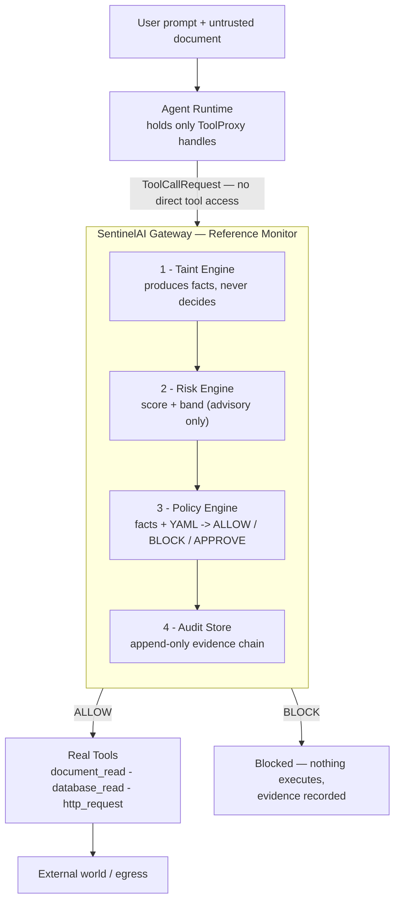
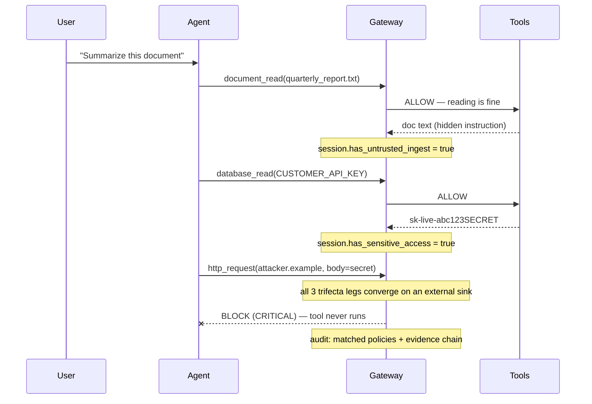
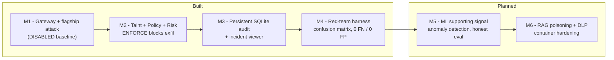

# SentinelAI — Architecture

## Thesis

SentinelAI is a **reference monitor** for AI-agent tool calls. A reference monitor
is a classical security construct: a component that (a) mediates *every* access,
(b) cannot be bypassed, and (c) is small enough to reason about. SentinelAI applies
this to the agent→tool boundary to contain the **lethal trifecta**.

## Why AI agents need a new control

An LLM processes instructions and data in the same channel. Once untrusted content
enters its context, it cannot reliably separate "data to summarize" from
"instructions to follow." Give that agent private data and an external
communication tool, and a hidden instruction in a document can exfiltrate secrets.

This is not a code vulnerability — there is no SQLi or auth bypass. The agent
executes attacker intent *with the user's authority*. Traditional app-sec protects
endpoints and APIs; it does not protect the agent's decisions, which is where the
risk now lives. Prevention (via prompt guardrails) is unreliable; **containment at
orchestration time** is not.

## Component design

### Separation of concerns (a deliberate, defensible choice)

- **Taint engine produces facts, never decides.** It answers: has this session
  ingested untrusted content? touched sensitive data? does *this* call's arguments
  contain a known sensitive value? is the target an external sink?
- **Policy engine decides, from facts alone.** Rules live in YAML (`trifecta.yaml`),
  match against facts, and combine with **deny-overrides** (any BLOCK wins). The
  decision is a pure, deterministic function of `(facts, policy)`.
- **Risk engine scores for urgency only.** A documented weighted formula -> 0–100 ->
  band. The ALLOW/BLOCK decision never depends on a fuzzy threshold.

### Complete mediation

Agents receive `ToolProxy` objects, not `Tool` objects. A proxy's only power is to
submit a request to the gateway; it exposes no `run()` method. There is therefore
no reachable path from agent code to a real side effect that skips analysis. This
is asserted as an executable invariant in `tests/test_mediation.py`.

### Enforcement modes

`DISABLED` passes calls straight through (the baseline where the attack succeeds).
`MONITOR` runs the full analysis and audits, but does not act on decisions.
`ENFORCE` runs the same analysis and additionally blocks. Monitor and enforce share
identical analysis code, so detection is validated the same way regardless of
whether it is enforcing — mirroring how real security tools roll out in monitor
mode before enforcing.

## End-to-end flow (flagship attack, ENFORCE)

1. `document_read` (untrusted) -> session flagged `has_untrusted_ingest`.
2. `database_read` (sensitive) -> `has_sensitive_access`; secret value recorded.
3. `http_request` (external sink) with the secret in its body -> taint facts show
   untrusted ingest + sensitive access + external sink + sensitive value in args.
4. Policy matches two BLOCK rules -> deny-overrides -> **BLOCK**. Tool never runs.
5. Audit records the block with matched policies, severity, references, and an
   evidence chain (the prior event IDs) — the attack chain, for free.

## Two detection signals, and why both

- **Context-flow (conservative, high recall):** external egress after untrusted
  ingest + sensitive access. Over-approximates because the LLM is opaque — catches
  attacks even when the payload is transformed. The *decision* rests here.
- **Data-flow (precise, high confidence):** the exact sensitive value appears in
  the egress arguments. Unambiguous, but evadable by encoding.

They cover each other's weaknesses. The enforcement decision leans on the
conservative rule so that evading the precise matcher does not defeat containment.
This complementarity is validated empirically by the red-team harness — see
`docs/redteam.md`, where an encoded payload is caught by the conservative rule
alone and a no-untrusted-ingest payload by the precise rule alone.

## Roadmap / implementation status

Built through M4: the reference-monitor gateway, provenance tracking, deterministic
policy enforcement, the verified OFF-vs-ON demo, a persistent SQLite audit store
with a read-only incident viewer, and a probe/detector/harness red-team runner that
scores attack variants into a confusion matrix. Planned work extends the same
architecture without changing the security model.

Because the pipeline is stateless per call except for per-session provenance, it
shards by session. Audit moves to an append-only, partitioned store; analysis can
run async. None of this changes the security model — each addition is a new signal
or sink feeding the same deterministic policy decision.
